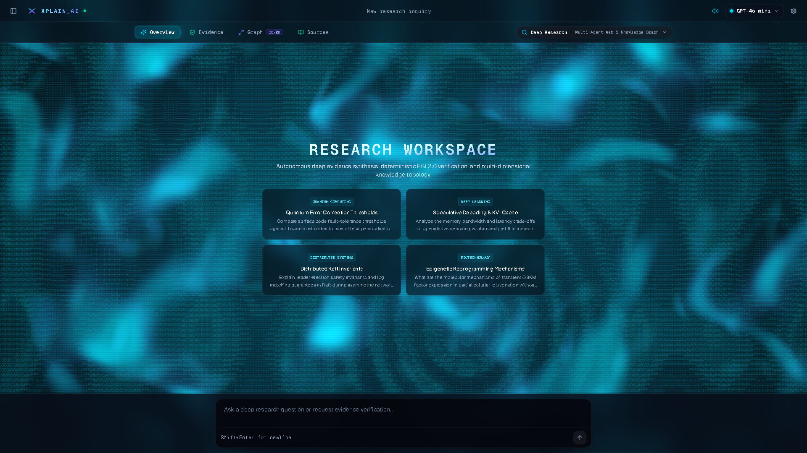
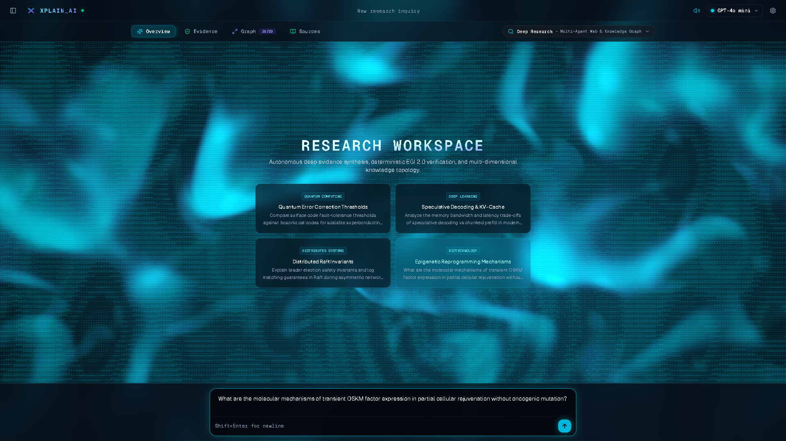
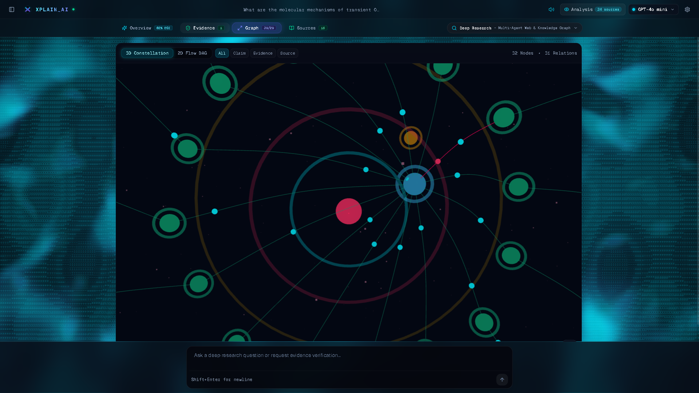
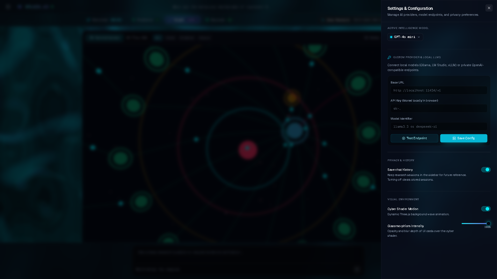

# XplainAI

[](LICENSE)

Explainable research workspace shipped for **IIIT Pune hackathon finals**. You type a query; the app crawls sources, breaks the answer into claims, and shows the evidence on a canvas — 2D graph or 3D constellation — instead of a sealed chat transcript.

React 19 + Vite on the front. FastAPI + LangGraph on the back. Keys stay on the client (BYOK).

## What it does

```mermaid
flowchart LR
  q[Research query] --> crawl[Crawl ArXiv Wikipedia HTML]
  crawl --> chunks[Evidence chunks]
  chunks --> claims[Proposition extraction]
  claims --> egi[Grounding score]
  egi --> graph[2D DAG and 3D graph]
```

- **Overview / Evidence / Graph / Sources** — four views of the same job.
- **Grounding score** — cosine + lexical overlap + domain weight + contradiction penalty. Not a published accuracy number.
- **BYOK** — OpenAI, Anthropic, Gemini, DeepSeek, or local Ollama. No keys in the repo.

## Screens









## Layout

| Piece | Stack |
| --- | --- |
| `apps/web` | React 19, Vite, ReactFlow, Three.js |
| `apps/api` | FastAPI, LangGraph |
| `infrastructure` | PostgreSQL + pgvector, Redis (optional via Docker) |

C4 notes: [docs/architecture/ARCHITECTURE.md](docs/architecture/ARCHITECTURE.md).

## Quick start

Needs Node 20+, pnpm 9+, Python 3.11+. Docker is optional (Postgres + Redis).

```bash
git clone https://github.com/mahik504/XplainAI.git
cd XplainAI
cp .env.example .env
docker compose up -d
```

- Web: `http://localhost:5173`
- API docs: `http://localhost:8000/docs`

Without Docker:

```bash
cd apps/api
python -m venv .venv
# Windows: .venv\Scripts\activate
pip install -e .
uvicorn neural_navigator.main:app --reload --port 8000
```

```bash
cd apps/web
pnpm install
pnpm dev
```

## Tests

```bash
cd apps/api && pytest tests/unit
cd apps/web && pnpm test && pnpm build
```

## License

MIT. See [LICENSE](LICENSE).
