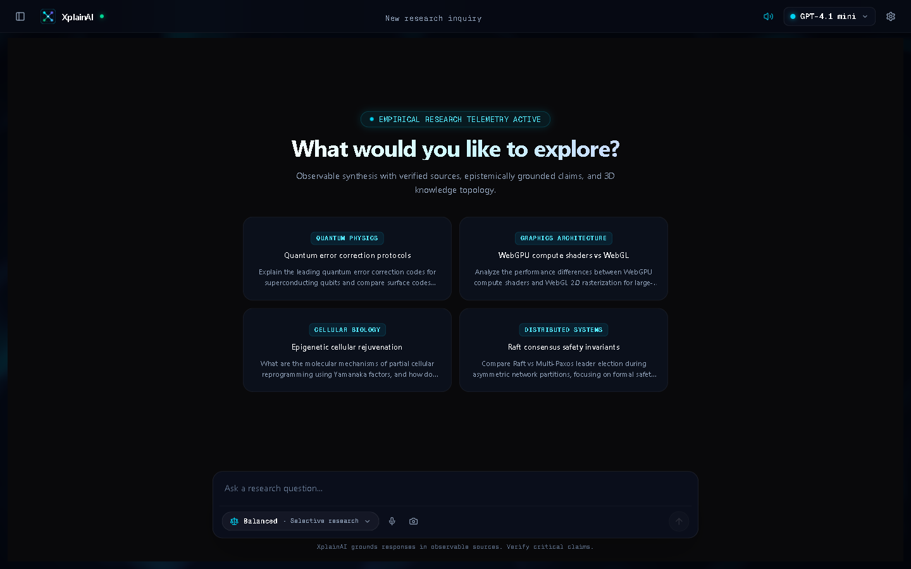
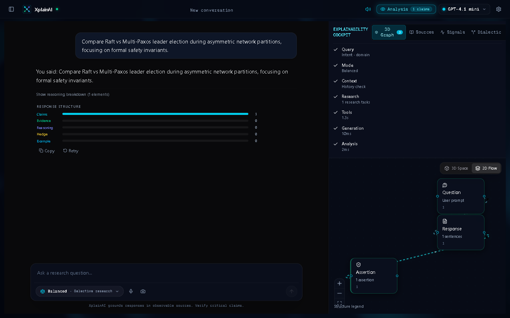
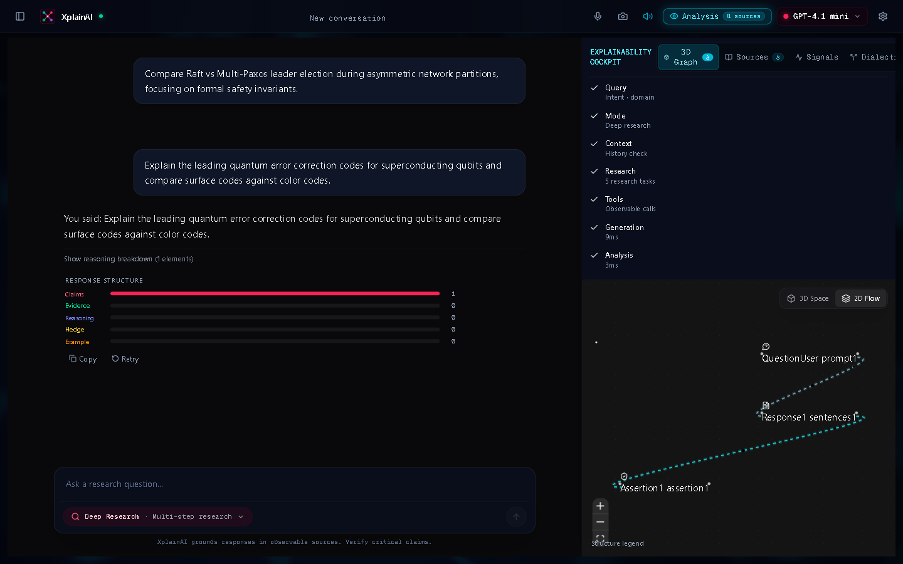
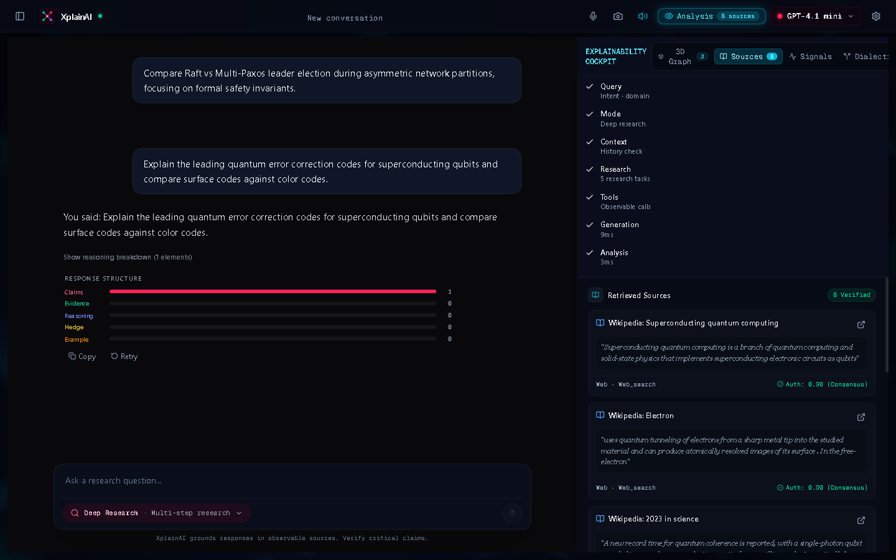
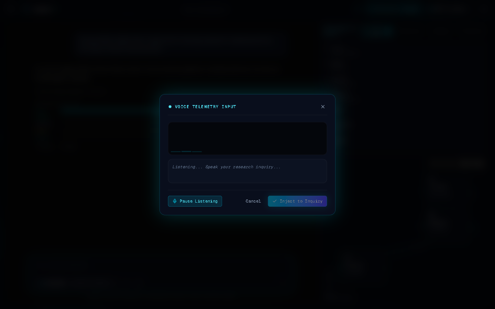

# XplainAI

<p align="center">
  <strong>An Explainable Intelligence & Deep Research Workspace that makes AI reasoning observable, verifiable, and visually inspectable.</strong>
</p>

<p align="center">
  
  
  
  
  
</p>

---

## Overview

Modern frontier language models produce dense answers, but users are left guessing which sentences are solid empirical claims, which are inferences, and which sources actually back them up.

**XplainAI** transforms standard AI generation into an **Observable Research Workspace**. As responses stream over WebSockets, the system performs real-time semantic decomposition on finished assistant text, compiling it into an interactive **2D Reasoning DAG** and a **3D Spatial Knowledge Constellation** — linking every assertion to verified citations from **ArXiv**, **Wikipedia**, and web evidence without exposing private model chain-of-thought.

---

## Visual Tour

### 1. Research Studio & Ambient Shader Canvas
*Deep space Obsidian Titanium canvas with interactive GPU-accelerated WebGL background shader, discrete voice/vision composer tools, and model switching.*



---

### 2. Dual-Engine Reasoning Visualizer (2D DAG & 3D Spatial Topology)

| 2D Reasoning Flow DAG | 3D Spatial Knowledge Galaxy |
| :---: | :---: |
|  |  |
| *Interactive DAG mapping assertions, evidence nodes, and inference pathways with live particle pulses.* | *Three.js WebGL orbit space visualizing claim clusters and citation proximity.* |

---

### 3. Verified Research Dossier & Input Telemetry

| Epistemic Sources Dossier | Voice Telemetry & Optical Vision |
| :---: | :---: |
|  |  |
| *Real-time academic citations from ArXiv and Wikipedia with authority confidence scores.* | *Web Audio API real-time frequency spectrum analyzer and optical camera document scanner.* |

---

## Core Capabilities

- **Observable Response Anatomy**: Classifies generated text into empirical assertions, supporting evidence, logical connectors, and uncertainty hedges.
- **Dual Visualizer Engine**:
  - **2D Reasoning DAG**: Built with ReactFlow, custom glass node cards, pulsing particle links, and status indicators.
  - **3D Spatial Topology**: Hardware-accelerated Three.js canvas rendering interactive orbital nodes with raycast inspection cards.
- **Multi-Mode Research Routing**:
  - **Fast**: Direct streaming synthesis for high-throughput queries.
  - **Balanced**: Selective multi-hop web retrieval and factual grounding.
  - **Deep Research**: Comprehensive multi-agent pipeline executing concurrent ArXiv and Wikipedia crawlers.
- **Multi-Agent Telemetry Stream**: Live monospace terminal exposing orchestrator stages (`[DECOMPOSER]`, `[CRAWLER_ARXIV]`, `[CRAWLER_WIKI]`, `[EVIDENCE_EVAL]`, `[DIALECTIC_ENGINE]`).
- **Multimodal Telemetry Input**: Native Web Speech API voice input with dynamic audio waveform visualizer and optical camera scanner HUD.
- **Client-Side Model Switching**: Out-of-the-box support for OpenAI (GPT-4.1 mini, GPT-4o), Anthropic (Claude 3.7 Sonnet), Google (Gemini 2.5), and custom local OpenAI-compatible endpoints with client-stored API keys.

---

## System Architecture

```
                                  ┌─────────────────────────────┐
                                  │      Client Workspace       │
                                  │  (React 19 + Tailwind CSS)  │
                                  └──────────────┬──────────────┘
                                                 │
                     ┌───────────────────────────┼───────────────────────────┐
                     ▼                           ▼                           ▼
            ┌─────────────────┐         ┌─────────────────┐         ┌─────────────────┐
            │  2D Flow DAG    │         │ 3D Constellation│         │ Semantic Parser │
            │  (ReactFlow)    │         │   (Three.js)    │         │ (Sentence AST)  │
            └─────────────────┘         └─────────────────┘         └─────────────────┘
                                                 │
                                                 │ WebSocket / REST
                                                 ▼
                                  ┌─────────────────────────────┐
                                  │     FastAPI Orchestrator    │
                                  └──────────────┬──────────────┘
                                                 │
                     ┌───────────────────────────┼───────────────────────────┐
                     ▼                           ▼                           ▼
            ┌─────────────────┐         ┌─────────────────┐         ┌─────────────────┐
            │ ArXiv Preprint  │         │ Wikipedia Vector│         │ LLM Streaming   │
            │     Crawler     │         │    Evaluator    │         │ (OpenAI/Claude) │
            └─────────────────┘         └─────────────────┘         └─────────────────┘
```

---

## Quickstart & Local Setup

### Prerequisites
- **Node.js**: 22+
- **pnpm**: 9+
- **Python**: 3.12+ (managed with `uv`)

### 1. Clone the Repository
```bash
git clone https://github.com/mahik504/XplainAI.git
cd XplainAI
```

### 2. Backend Setup
```bash
cd backend
uv sync
cp .env.example .env

# Start the FastAPI backend server (port 8000)
uv run uvicorn neural_navigator.main:app --host 127.0.0.1 --port 8000 --reload
```

### 3. Frontend Setup
```bash
# In a new terminal from the project root:
pnpm install

# Start the Vite development server (port 5173)
pnpm --filter @neural-navigator/web dev
```

Open `http://localhost:5173` in your browser.

---

## Testing & Quality Assurance

XplainAI maintains a strict zero-warning test suite across both frontend packages and the Python backend:

```bash
# Run TypeScript compilation check
pnpm -r typecheck

# Run Vitest test suites (contracts and frontend)
pnpm -r test

# Run Backend unit & integration test suite
uv run pytest tests/unit/
```

---

## Project Structure

```
XplainAI/
├── backend/
│   ├── src/neural_navigator/
│   │   ├── agents/          # Multi-agent orchestrators & evaluators
│   │   ├── api/             # FastAPI REST endpoints & WebSocket handlers
│   │   ├── core/            # Config, telemetry, and logging
│   │   ├── domain/          # Data contracts and domain entities
│   │   ├── llm/             # Streaming providers (OpenAI, Claude, Echo)
│   │   └── orchestration/   # Graph engine and stage state machines
│   └── tests/               # Pytest unit & integration suites
├── frontend/
│   ├── src/
│   │   ├── app/             # App shell, top navigation, and global tokens
│   │   ├── components/      # Common UI primitives, WebGL shader canvas, logo
│   │   ├── features/
│   │   │   ├── conversation/# Chat panel, composer, mode selector
│   │   │   ├── explainability/# Explainability cockpit, sources, terminal
│   │   │   ├── graph-visualizer/# 2D ReactFlow DAG & 3D Three.js Constellation
│   │   │   ├── history/     # Chronological inquiry sidebar
│   │   │   ├── vision/      # Holographic camera vision scanner
│   │   │   └── voice/       # Voice telemetry modal with audio spectrum
│   │   └── stores/          # Zustand session, conversation, and UI stores
├── shared/
│   └── packages/contracts-ts/ # Shared TypeScript schemas & validation
└── docs/
    └── screenshots/         # Production UI captures & assets
```

---

## License

This project is licensed under the [MIT License](LICENSE).
