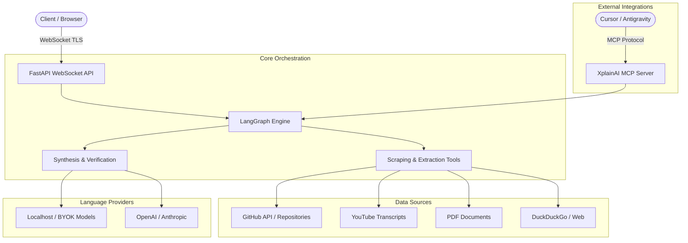

# XplainAI

**Advanced Orchestral Web Scraping & Visual Neural Navigation**

[](https://github.com/MAHI/XplainAI/actions)
[](https://github.com/MAHI/XplainAI/blob/main/LICENSE)
[](https://fastapi.tiangolo.com/)
[](https://reactjs.org/)

---

## Overview

XplainAI is an advanced, multi-agent deep research and visual intelligence framework. Designed for researchers, security analysts, and engineers, XplainAI leverages a LangGraph-powered orchestration engine to conduct complex web scraping, autonomous information extraction, and synthesized reasoning. 

Unlike traditional black-box LLM wrappers, XplainAI makes its reasoning fully transparent. Every claim is grounded in structured citations, and the system renders its epistemic processes through hardware-accelerated topological graphs.

## Core Capabilities

- **Deep Agentic Orchestration**: Autonomous planning, extraction, and synthesis powered by LangGraph. It effortlessly navigates across GitHub repositories, YouTube transcripts, PDF documents, and standard web sources.
- **Transparent Epistemics**: Real-time visualization of source evidence and claim generation.
- **Enterprise Security (BYOK)**: Native support for transient local models. Connect a local Ollama instance (`http://localhost:11434/v1`) via WebSockets to perform deep research without any data leaving your infrastructure.
- **Model Context Protocol (MCP)**: Mount XplainAI as a standard MCP server to supercharge external agents (e.g., Cursor, Antigravity, Lyra) with orchestrated deep-scraping toolsets.
- **Ephemeral Execution**: Strict zero-trace operations for sensitive queries.

---

## Architecture

XplainAI operates on a decoupled architecture, isolating the asynchronous orchestration layer from the reactive rendering pipeline.



---

## Getting Started

### Prerequisites
- Node.js 18+ and `pnpm`
- Python 3.10+ and `uv`

### Installation

1. **Clone the repository:**
```bash
git clone https://github.com/MAHI/XplainAI.git
cd XplainAI
```

2. **Backend Setup:**
```bash
cd backend
uv venv
uv pip install -e .
uv run uvicorn neural_navigator.api.main:app --reload --port 8000
```

3. **Frontend Setup:**
In a separate terminal:
```bash
cd frontend
pnpm install
pnpm dev --port 3000
```
Access the interface at `http://localhost:3000`.

---

## Integrating with MCP (Model Context Protocol)

XplainAI can function as a headless deep-research engine for your existing coding assistants. To attach the MCP server:

```json
{
  "mcpServers": {
    "xplainai": {
      "command": "uv",
      "args": ["run", "python", "src/mcp_server.py"],
      "cwd": "/absolute/path/to/XplainAI/backend"
    }
  }
}
```

## Security & Privacy

XplainAI does not proxy authentication credentials to external telemetry servers. The frontend natively provisions your API keys over a secure WebSocket directly to the backend instance. The backend instantiates a transient LLM provider exclusively for the duration of the request.

## License

Distributed under the MIT License. See `LICENSE` for details.
