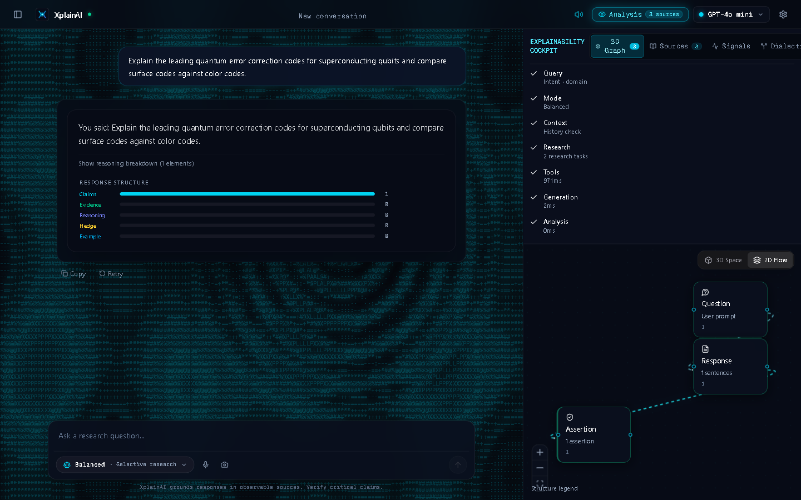

<div align="center">
  
  <h1>XplainAI 🔮</h1>
  <p><strong>Advanced Orchestral Web Scraping & Visual Neural Navigation</strong></p>

  <p>
    <a href="https://github.com/MAHI/XplainAI/actions"></a>
    <a href="https://github.com/MAHI/XplainAI/blob/main/LICENSE"></a>
    <a href="https://fastapi.tiangolo.com/"></a>
    <a href="https://reactjs.org/"></a>
    <a href="https://tailwindcss.com/"></a>
  </p>
</div>

---

## 🚀 Overview

**XplainAI** is an advanced, agentic deep-research tool and visual intelligence navigator. Built for researchers, developers, and knowledge workers, XplainAI uses a LangGraph-powered orchestration engine to scrape the web, extract data from complex documents, and visually explain its reasoning using hardware-accelerated graphs and epistemic breakdowns.

Say goodbye to black-box LLMs. Watch your models think, scrape, cite, and verify.

## ✨ Key Features

- 🧠 **Deep Agentic Orchestration**: LangGraph-powered reasoning capable of planning, web scraping, and data extraction across multiple steps.
- 🎨 **Hyper-Glassmorphic UI**: Gorgeous frontend built with Next.js, Framer Motion, and Three.js ambient shaders. Dark mode by default, beautifully translucent.
- 🔐 **Bring Your Own Key (BYOK) & Localhost**: Fully functional transient LLM provisioning. Hook up OpenAI, Anthropic, or local Ollama instances (`http://localhost:11434/v1`) without data leaving your machine.
- 🔌 **Universal MCP Server**: Integrated Model Context Protocol (MCP) server. Connect XplainAI directly to **Cursor, Antigravity, and Lyra** to supercharge your external coding agents with deep web-scraping powers.
- 🕵️ **Ephemeral Mode**: Strict privacy mode. Chats vanish on session end, leaving zero trace in the database.
- ♿ **Accessible**: Screen-reader ready (`aria-live="polite"`), semantic HTML, and fluid keyboard navigation.

---

## 🏗️ Architecture

XplainAI operates via a dual-core architecture, utilizing an asynchronous event-driven backend and a reactive, shader-accelerated frontend.



### Directory Structure

```text
📦 XplainAI
 ┣ 📂 backend/        # FastAPI, LangGraph Orchestrator, Websockets, MCP Server
 ┣ 📂 frontend/       # Next.js UI, Three.js Shaders, Framer Motion, Tailwind
 ┣ 📂 docs/           # PRDs, Architecture Decisions (ADRs), Research Papers
 ┣ 📂 shared/         # Shared configurations and contracts
 ┣ 📂 infra/          # Docker, Kubernetes, Terraform setups
 ┣ 📂 tools/          # Codegen and standalone scripts
 ┣ 📜 package.json    # Monorepo setup
 ┗ 📜 docker-compose.yml
```

---

## 🛠️ Getting Started

### Prerequisites
- Node.js 18+ and `pnpm`
- Python 3.10+ and `uv`

### 1. Clone & Setup
```bash
git clone https://github.com/MAHI/XplainAI.git
cd XplainAI

# Install frontend dependencies
pnpm install

# Install backend dependencies
cd backend
uv venv
uv pip install -e .
```

### 2. Run the Backend
```bash
cd backend
uv run uvicorn neural_navigator.api.main:app --reload --port 8000
```

### 3. Run the Frontend
In a new terminal:
```bash
cd frontend
pnpm dev
```
Access the application at `http://localhost:3000`.

---

## 🔌 Connecting to MCP (Cursor / Antigravity)

You can expose XplainAI's deep research capabilities to your local AI coding assistants via the Model Context Protocol.

1. Ensure your backend environment is setup.
2. Configure your agent (Cursor, Antigravity, etc.) to use the XplainAI MCP server by adding this command to your MCP configuration:
   ```json
   {
     "mcpServers": {
       "xplainai": {
         "command": "uv",
         "args": ["run", "python", "src/mcp_server.py"],
         "cwd": "/absolute/path/to/XplainAI/backend"
       }
     }
   }
   ```
3. Your coding assistant can now run deep-research orchestrations natively!

---

## 🛡️ Privacy & BYOK Security

XplainAI does not proxy your API keys to external telemetry servers. The frontend natively provisions your `customApiBase` and `customApiKey` over a secure WebSocket directly to your running backend instance. The backend instantiates a transient LLM provider for the duration of the request and aggressively cleans it up afterward. 

For maximum security, we recommend running a local Ollama instance and routing XplainAI to `http://localhost:11434/v1`.

---

## 📝 License

Distributed under the MIT License. See `LICENSE` for more information.

---
<div align="center">
  <i>Developed with precision by <b>MAHI</b></i>
</div>
