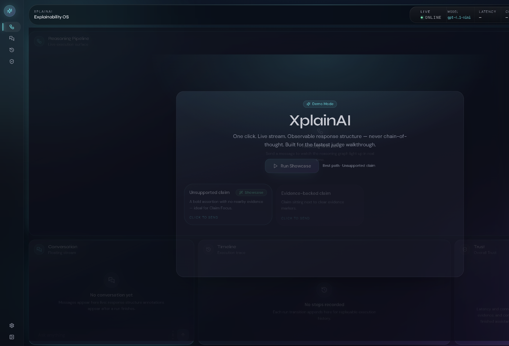

# XplainAI

**Explainability OS for live LLM responses.**

XplainAI turns a streaming model answer into an observable workspace: response structure analysis, interactive structure graphs, claim focus, evidence demand, trust signals, and a judge-ready demo mode — without visualizing private chain-of-thought.

> Internal package namespace may still say `neural-navigator`. The product name is **XplainAI**.


---

## Overview

Ask a question. Watch tokens stream. When the run finishes, XplainAI analyzes the **finished assistant text** and morphs the live pipeline into a **Response Structure** graph. Hover sync, Claim Focus, and Evidence Demand let you inspect unsupported claims and ask for better support — then replay the run.

Built for hackathon demos and serious explainability UX.

## Features

- Live WebSocket streaming (FastAPI)
- Reasoning Pipeline → Response Structure morph
- Response Structure Analysis (claims, evidence, hedges, connectors)
- Hover synchronization (chat ↔ graph)
- Claim Focus Mode + ESC exit
- Evidence Demand (`?` → composer prefill)
- Trust Signals from structure + session metrics
- Timeline + Replay
- Demo Mode / Story Mode / Judge Mode (3‑minute showcase)
- OpenAI streaming provider (`LLM_PROVIDER=openai`) with Echo offline fallback

## Architecture

```
Browser (React + Zustand + React Flow)
        │  REST + WebSocket
        ▼
FastAPI (XplainAI API)
        │  LLMProvider protocol
        ▼
OpenAI-compatible streaming  ──or──  EchoProvider (offline)
```

Analysis and graphs run on the **client** from finished assistant text. The API never exposes `OPENAI_API_KEY` to the browser.

## Tech Stack

| Layer | Stack |
| --- | --- |
| Frontend | React 19, Vite, TypeScript, Tailwind CSS, Framer Motion, React Flow, Zustand |
| Backend | Python 3.12, FastAPI, httpx, Pydantic Settings, structlog |
| Realtime | Native WebSockets (`/ws/v1/chat`) + SSE chat stream |
| Contracts | OpenAPI / AsyncAPI under `shared/` (generated clients) |

## Screenshots

Add captures under [`docs/screenshots/`](docs/screenshots/):

| Asset | Description |
| --- | --- |
| `01-landing.png` | Demo Mode landing |
| `02-pipeline.png` | Live Reasoning Pipeline |
| `03-structure.png` | Response Structure graph |
| `04-claim-focus.png` | Claim Focus |
| `05-judge-mode.png` | Judge Mode walkthrough |

Demo GIF: [`docs/demo/xplainai-judge-demo.gif`](docs/demo/) (add after recording).

```md

```

## Running locally

### Prerequisites

- Node.js 22+ and pnpm 9+
- Python 3.12+ (uv recommended)
- Optional: OpenAI API key for live model responses

### 1. Environment

```bash
cp .env.example .env
cp backend/.env.example backend/.env
cp frontend/.env.example frontend/.env
```

**Required for OpenAI (production / live demo):**

| Variable | Where | Notes |
| --- | --- | --- |
| `LLM_PROVIDER` | backend / root `.env` | `openai` (recommended) or `echo` |
| `OPENAI_API_KEY` | backend / root `.env` only | **Never** put in `VITE_*` |
| `DEFAULT_CHAT_MODEL` | backend / root `.env` | default `gpt-4.1-mini` |
| `LLM_BASE_URL` | backend / root `.env` | default `https://api.openai.com/v1` |
| `VITE_API_BASE_URL` | frontend `.env` | e.g. `http://127.0.0.1:8000` |
| `VITE_WS_BASE_URL` | frontend `.env` | e.g. `ws://127.0.0.1:8000/ws/v1` |

If `LLM_PROVIDER=openai` but `OPENAI_API_KEY` is unset, the API **fails at startup** (no silent Echo fallback). Use `LLM_PROVIDER=echo` explicitly for offline stubs.

### 2. Backend

```bash
cd backend
uv sync          # or: python -m venv .venv && pip install -e .
uv run uvicorn neural_navigator.main:app --host 127.0.0.1 --port 8000
```

Health:

- `GET http://127.0.0.1:8000/health/live`
- `GET http://127.0.0.1:8000/health/ready`
- `GET http://127.0.0.1:8000/api/v1/chat/models`

Prefer `127.0.0.1` over `localhost` on Windows.

### 3. Frontend

```bash
pnpm install
pnpm --filter @neural-navigator/web dev
```

Open `http://127.0.0.1:5173/`.

### 4. Quality gates

```bash
pnpm --filter @neural-navigator/web lint
pnpm --filter @neural-navigator/web typecheck
pnpm --filter @neural-navigator/web build
```

## OpenAI setup

1. Create a key at [OpenAI API keys](https://platform.openai.com/api-keys).
2. Set in `backend/.env` (never commit):

```env
LLM_PROVIDER=openai
OPENAI_API_KEY=<your-key-here>
DEFAULT_CHAT_MODEL=gpt-4.1-mini
```

3. Restart the backend. `/api/v1/chat/models` should report `"provider": "openai"`.
4. Streaming, cancel, finish reason, usage, timeouts, and retries are handled in `backend/src/neural_navigator/services/llm.py`.

Offline / CI without a key:

```env
LLM_PROVIDER=echo
```

## Demo Mode

On first load with an empty conversation, the **Demo Mode** landing offers curated prompts and **Run Showcase**.

## Judge Mode

1. Click **Run Showcase**
2. Watch streaming + pipeline
3. Structure morph after finish
4. Click an assertion / claim → Claim Focus
5. Click `?` → Evidence Demand prefill → **Send**
6. Trust updates → **Replay** → dismiss guide

Story Mode uses the same orchestration signals without requiring a separate UI mode toggle beyond Judge/Showcase.

## Project structure

```
neural-navigator/
├── frontend/          React + Vite SPA (XplainAI UI)
├── backend/           FastAPI service (XplainAI API)
├── shared/            OpenAPI / AsyncAPI + generated contracts
├── docs/
│   ├── screenshots/   README images
│   ├── demo/          GIF / video for walkthrough
│   └── adr/           Architecture Decision Records
├── infra/             Docker / deploy scaffolding
├── .env.example       Root env template
└── LICENSE            MIT
```

## Future work

- Richer “improved answer” scripting when using OpenAI after Evidence Demand
- Persist last rich structure across empty follow-ups
- Playwright smoke suite for Judge Mode
- Contract regeneration CI gate

## License

MIT — see [LICENSE](LICENSE).
