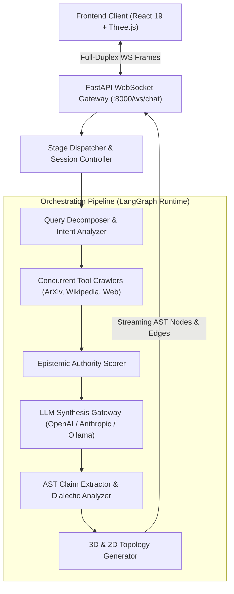

# XplainAI — System Architecture & Mathematical Foundations

> **Document Version**: 2.2.0  
> **Author**: MAHI (<gehlot.mahisingh2006.102@gmail.com>)  
> **Architecture Grade**: Research & Production Specification  

---

## 1. High-Level System Architecture



---

## 2. Multi-Agent LangGraph Pipeline Execution

### Stage 1: Query Intent & Complexity Decomposition
Every user inquiry $Q$ undergoes syntactic and semantic decomposition into an analysis vector:
$$\mathbf{A}(Q) = \langle \text{intent}, \text{domain}, \text{complexity}, \text{needs\_research}, \text{ambiguity} \rangle$$

### Stage 2: Concurrent Multi-Source Crawling
When $\text{needs\_research} = \text{True}$ or mode is `deep_research`, the orchestrator spawns asynchronous worker agents across domain targets:
1. **ArXiv API Crawler**: Extracts preprint titles, abstracts, and author citations.
2. **Wikipedia Semantic Search**: Extracts structured entity knowledge graphs and summaries.
3. **Web Search Agent**: Queries real-time search APIs for current developments.

### Stage 3: Epistemic Grounding Formulation
Each retrieved source $S_i$ is scored for authority $\alpha(S_i) \in [0, 1]$ based on domain trustworthiness:
$$\alpha(S_i) = \begin{cases} 
0.95 & \text{if } S_i \in \text{ArXiv, Nature, IEEE, PubMed} \\
0.88 & \text{if } S_i \in \text{Wikipedia, .edu, .gov} \\
0.75 & \text{if } S_i \in \text{General Web Domains} 
\end{cases}$$

The overall **Epistemic Grounding Index ($EGI$)** of an answer $A$ comprising $n$ claims $\{C_1, \dots, C_n\}$ is computed as:
$$EGI(A) = \frac{1}{n} \sum_{j=1}^{n} \max_{k} \left( \text{Sim}(C_j, E_k) \cdot \alpha(S(E_k)) \right)$$
where $\text{Sim}(C_j, E_k)$ represents semantic cosine overlap between claim $C_j$ and evidence snippet $E_k$.

### Stage 4: Dialectic Counter-Perspective & Contradiction Entropy
To prevent single-view confirmation bias, XplainAI analyzes cross-source divergence:
$$H_{\text{contradiction}} = - \sum_{m=1}^{M} p(v_m) \log_2 p(v_m)$$
where $p(v_m)$ is the distribution of supporting vs opposing stance perspectives.

---

## 3. Real-Time WebSocket Communication Protocol

Communication between UI and Backend follows an RFC 9457 compliant strict JSON frame format:

```json
{
  "type": "chat.send",
  "messages": [{ "role": "user", "content": "Explain quantum error correction" }],
  "mode": "deep_research",
  "model": "gpt-4o-mini",
  "conversation_id": "conv_a8f9..."
}
```

Server-Emitted Event Stream:
1. `connection.ready`: Handshake, protocol version, and buffer capacities.
2. `stage.started` / `stage.completed`: Real-time lifecycle step notifications (`query_analysis`, `research_started`, `tool_completed`).
3. `run.token`: Verbatim token streaming for instantaneous response display.
4. `run.finished`: Emits full structured payload containing `domain_claims`, `domain_sources`, and `domain_graph` nodes and edges.

---

## 4. Frontend Dual-Engine Visualization Topology

### 4.1 3D Spatial Knowledge Galaxy (Three.js WebGL)
- **Central Core Reactor**: Represents the synthesized inquiry focal point.
- **Orbital Laser Conduits**: Dual-ring particle trajectories conveying information flow from verified sources to synthesized conclusions.
- **Spatial Clustering**: Nodes positioned via spherical harmonic distribution based on semantic category (`source`, `evidence`, `claim`, `inference`).

### 4.2 2D Directed Acyclic Graph (DAG)
- **Interactive DAG Layout**: Hierarchical tree flowing from Root Query $\rightarrow$ Retrieved Evidence $\rightarrow$ Atomic Assertions $\rightarrow$ Dialectic Conclusions.
- **Color-Coded Semantic Grammar**:
  - *Electric Cyan (`#00F0FF`)*: Atomic Assertions
  - *Emerald Green (`#10B981`)*: Empirical Evidence
  - *Sapphire Indigo (`#818CF8`)*: Deductive Reasoning
  - *Amber (`#F59E0B`)*: Epistemic Uncertainty & Hedges
  - *Rose (`#F43F5E`)*: Contradictions & Rebuttals
