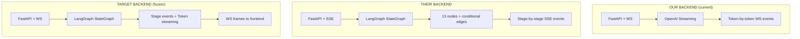
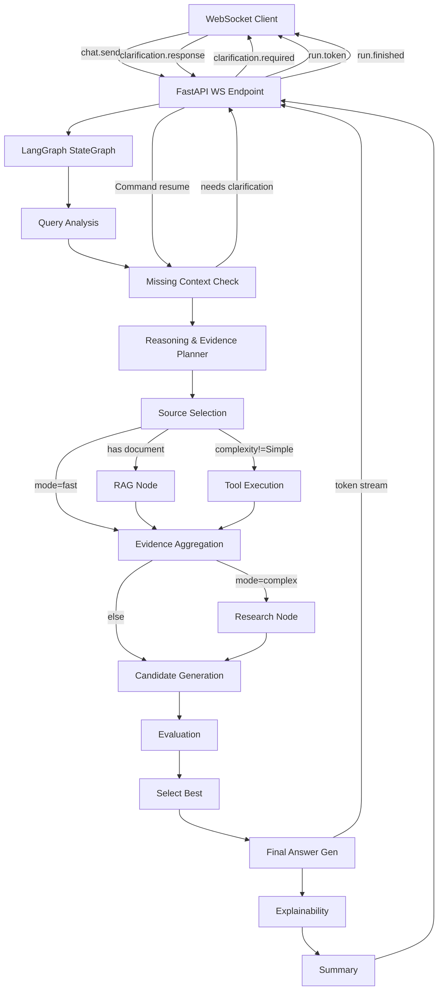

# XplainAI — Prototype Fusion Architecture Audit

**Date:** 2026-08-08  
**Status:** Implementation Specification — DO NOT MODIFY CODE YET  
**Source of truth:** Our repository (`neural-navigator`)  
**Reference:** Teammate repository (`XplainAI-main`)

---

## 1. Executive Summary

Our project and the reference project solve the same PS01 problem from opposite directions:

| | **Our Project (Neural Navigator)** | **Their Project (XplainAI-main / ReasonLens)** |
|---|---|---|
| **Architecture** | Production-grade monorepo (TypeScript + Python, Zustand, XYFlow, WebSocket) | Rapid prototype (vanilla JSX, raw `useState`, SSE, single-file LangGraph) |
| **Strength** | Post-hoc response structure analysis, interactive claim/evidence graph, trust signals | Real LangGraph orchestration, multi-stage pipeline, tools, RAG, conversation history |
| **Weakness** | No backend reasoning graph, no tool calling, no RAG, no conversation persistence | No honest XAI layer, hardcoded API keys, no test coverage, no cancellation |

**The fusion strategy is clear:**

> Keep our production frontend + XAI layer as the shell.  
> Import their LangGraph orchestration, tools, RAG, and history concepts into our backend.  
> Unify the event protocol so the frontend can visualize real backend stages.

---

## 2. Architecture Comparison



### Backend Stack

| Layer | Ours | Theirs | Target |
|---|---|---|---|
| Framework | FastAPI + uvicorn | FastAPI + uvicorn | FastAPI + uvicorn |
| Transport | WebSocket (bidirectional) | SSE (unidirectional) | **WebSocket** (keep ours) |
| LLM Client | `openai` SDK via `ChatOpenAI` | `langchain-openai` `ChatOpenAI` | `langchain-openai` (adopt theirs) |
| Orchestration | None (direct streaming) | LangGraph `StateGraph` | **LangGraph** (adopt theirs) |
| Persistence | None (in-memory only) | SQLite (`reasonlens.db`) | SQLite or PostgreSQL |
| Config | Pydantic `Settings` with `SecretStr` | `os.getenv()` + hardcoded keys | **Pydantic Settings** (keep ours) |
| Tests | Placeholder structure | None | Must add |

### Frontend Stack

| Layer | Ours | Theirs | Target |
|---|---|---|---|
| Language | TypeScript | JavaScript (JSX) | **TypeScript** (keep ours) |
| State | Zustand store | Raw `useState` | **Zustand** (keep ours) |
| Graph lib | `@xyflow/react` v12 | `reactflow` v11 | **@xyflow/react** (keep ours) |
| Markdown | `MessageMarkdown` component | `react-markdown` | Keep ours, ensure it renders correctly |
| Styling | CSS custom properties + shadcn | CSS variables + inline styles | Keep ours |
| Client | WebSocket (`ws-client.ts`) | `EventSource` (`useSSE.js`) | **WebSocket** (keep ours) |

---

## 3. Feature Comparison Matrix

| # | Feature | Their Implementation | Our Implementation | Better | Merge Decision | Strategy |
|---|---------|---------------------|--------------------|----|------|------|
| 1 | **LLM abstraction** | `ChatOpenAI` via LangChain, single model, hardcoded key | Multi-provider system (`OpenAI`, `Echo`), `SecretStr`, startup validation | **Ours** (secure) | KEEP OURS + add LangChain wrapper | Wrap our config in a LangChain-compatible `ChatOpenAI` init |
| 2 | **Streaming** | No token streaming — waits for full node completion, then sends `stage_complete` | Real token-by-token WebSocket streaming | **Ours** | KEEP OURS | Add stage events alongside token stream |
| 3 | **LangGraph orchestration** | Full 13-node `StateGraph` with conditional routing | None | **Theirs** | TAKE FROM THEIRS | Implement `StateGraph` in our backend |
| 4 | **Transport protocol** | SSE (unidirectional, no cancellation) | WebSocket (bidirectional, cancel support) | **Ours** | KEEP OURS | Bridge LangGraph events to WS frames |
| 5 | **Query analysis** | Dedicated LLM node → structured JSON (intent, domain, complexity, ambiguity) | None | **Theirs** | TAKE FROM THEIRS | Add as first graph node |
| 6 | **Missing-context detection** | `interrupt()` based, LLM-driven, up to 4 questions | None | **Theirs** | TAKE FROM THEIRS | Implement with WS-based clarification flow |
| 7 | **Clarification interrupts** | LangGraph `interrupt()` + `Command(resume=)` | None | **Theirs** | TAKE CONCEPT | Re-implement using WS `clarification.required` + `clarification.response` |
| 8 | **Reasoning planner** | Dedicated LLM node selecting tools and strategy | None | **Theirs** | TAKE FROM THEIRS | Add as graph node |
| 9 | **Tool routing** | LLM `bind_tools()` with `tool_choice="any"` for forced execution | None | **Theirs** | TAKE FROM THEIRS | Integrate as graph node |
| 10 | **Web search** | `DuckDuckGoSearchResults` | None | **Theirs** | TAKE FROM THEIRS | Add as optional tool |
| 11 | **Research mode** | Scoped scholarly search (arxiv, pubmed, IEEE, etc.) + LLM summary | None | **Theirs** | TAKE FROM THEIRS | Add as conditional deep-research node |
| 12 | **Document upload** | FastAPI file upload → local disk | None | **Theirs** | TAKE FROM THEIRS | Add upload endpoint |
| 13 | **RAG** | PyPDF/Docx/PPT loaders → FAISS → retriever | None | **Theirs** | TAKE FROM THEIRS | Implement with proper chunking |
| 14 | **Conversation history** | SQLite `messages` table, `full_state` serialization | In-memory only (lost on refresh) | **Theirs** | TAKE CONCEPT | Use our DB migration framework (Alembic) |
| 15 | **Conversation persistence** | `conversations` + `messages` tables, list/get/delete APIs | None | **Theirs** | TAKE CONCEPT | Integrate with Alembic |
| 16 | **Multiple modes** | Fast / Moderate / Deep Research / Reverse Mind / Document Analysis — actually changes routing | None (frontend-only concept) | **Theirs** | TAKE FROM THEIRS | Implement 3 modes: Fast, Balanced, Deep Research |
| 17 | **Feedback system** | Thumbs up/down → LLM-derived "PREFER/AVOID" rules → injected into answer prompt | None | **Theirs** | TAKE CONCEPT | Simplified version — store preferences, inject into system prompt |
| 18 | **Graph visualization** | `transformToFlow` generates linear stages + branching approach nodes + final answer node | `buildRunGraph` (4 linear nodes) + `buildResponseStructureGraph` (post-hoc structure nodes) | **Ours** (richer XAI) | KEEP OURS + extend | Show backend stages as graph phases, then structure graph on completion |
| 19 | **Response analysis** | None (backend generates explainability JSON via LLM) | `response-analyzer.ts` — regex-based sentence classification (claim, evidence, hedge, etc.) | **Ours** (honest XAI) | KEEP OURS | This is our core differentiator |
| 20 | **Explainability** | LLM-generated explainability JSON (decision factors, confidence, sources) | Post-hoc structural analysis of output text | **BOTH** | MERGE | Use backend explainability state + our frontend structural analysis |
| 21 | **Claim focus** | None | `claim-focus.ts` — proximity-based evidence linking, support level calculation | **Ours** | KEEP OURS | Core XAI feature |
| 22 | **Evidence demand** | None | `unsupported-claims.ts` — detect claims without nearby evidence, prompt user to ask for more | **Ours** | KEEP OURS | Core XAI feature |
| 23 | **Uncertainty signals** | None (hedges not tracked) | `response-analyzer.ts` classifies hedge sentences, hedging ratio | **Ours** | KEEP OURS | Core XAI feature |
| 24 | **Trust / response signals** | Fake metrics panel (hardcoded fallback values like 90%, 85%, 92%, 96%) | `buildTrustProjection()` — computed from latency, finish reason, evidence/reasoning scores | **Ours** (observable) | KEEP OURS | Extend with backend confidence data |
| 25 | **Timeline replay** | None | `TimelinePanel` with timestamped events | **Ours** | KEEP OURS | Show real backend stage transitions |
| 26 | **Judge mode** | None | Story Mode + Judge Mode demo choreography | **Ours** | KEEP OURS | Demo feature |
| 27 | **Story mode** | None | `use-story-orchestration.ts` automated demo flow | **Ours** | KEEP OURS | Demo feature |
| 28 | **Markdown rendering** | `react-markdown` with `.markdown-body` CSS | `MessageMarkdown.tsx` component | Need to verify ours works | KEEP OURS | Ensure rendering works |
| 29 | **Export** | JSON download + PNG screenshot of reasoning tree | None | **Theirs** | TAKE FROM THEIRS | Add export buttons |
| 30 | **Frontend navigation** | 3-panel: Sidebar + Chat + XAI Panel | AppShell + Sidebar + 4 workspace panels | **Ours** (richer) | KEEP OURS | Add history sidebar |
| 31 | **Responsive layout** | Resizable panels via mouse drag | Responsive via CSS + media queries | **Theirs** is simpler | KEEP OURS | Improve breakpoints |
| 32 | **Animations** | `fadeIn`, `message-enter`, spin | `framer-motion` (unused), CSS keyframes, particle edges | **Ours** (particle edges) | KEEP OURS | |
| 33 | **Typography** | Inter via Google Fonts | Inter via system font stack | **Same** | KEEP OURS | |
| 34 | **Visual design** | Radial gradients on body, glass panels | Ambient background, glass panels, oklch colors | **Ours** (more polished) | KEEP OURS | |
| 35 | **Accessibility** | None explicit | None explicit | **Neither** | REBUILD | Add ARIA labels, keyboard nav |
| 36 | **Error handling** | Basic `try/catch`, error SSE event | Structured error frames, connection-loss detection, last-error state | **Ours** | KEEP OURS | |
| 37 | **Security** | `.env` with real keys committed, hardcoded API keys in source, `allow_origins=["*"]` | `SecretStr`, startup validation, `.env` in `.gitignore`, CORS restricted | **Ours** | KEEP OURS | |
| 38 | **Testing** | None | Vitest + Playwright structure (placeholder) | **Ours** (has structure) | KEEP OURS | Add real tests |

---

## 4. Backend Features Worth Importing

### 4.1 LangGraph StateGraph (P0)

Their graph defines a **13-node pipeline** with conditional routing:

```
START → query_analysis → missing_context_detector → reasoning_evidence_planner 
→ source_selection → [rag_node | tool_execution] → evidence_aggregation 
→ [research_node] → candidate_generation → evaluation → select_best 
→ final_answer → explainability → reasoning_tree → summary → END
```

**What to adopt:**
- The `StateGraph` topology and `State` TypedDict schema
- Conditional routing based on mode and complexity
- The `interrupt()` / `Command(resume=)` pattern for clarification

**What NOT to adopt:**
- Hardcoded API keys (lines 48-50 of `graph.py`)
- `parse_json_response()` — fragile JSON extraction from LLM output
- `state["key"] = value` mutation pattern — use LangGraph's proper return-dict pattern

### 4.2 Tools (P1)

Worth importing:
- `DuckDuckGoSearchResults` — web search
- `calculator` — basic math
- `get_weather` — live weather
- `get_news` — news API

**NOT worth importing:**
- `get_stock_price` — Alpha Vantage free tier is rate-limited, not reliable for demos
- Hardcoded API keys — must use env vars

### 4.3 RAG Pipeline (P1)

Worth importing:
- PDF/DOCX/PPTX document loaders
- `RecursiveCharacterTextSplitter` chunking
- FAISS vector store
- Retriever integration

**NOT worth importing:**
- Media file processing (Whisper transcription) — too complex for hackathon, requires ffmpeg
- In-memory `_vector_store_cache` — needs proper lifecycle management

### 4.4 Conversation History (P1)

Worth importing:
- `conversations` + `messages` SQLite schema
- `get_history()`, `get_conversation()`, `delete_conversation()` APIs

**Integration path:** Use our Alembic migration framework instead of raw `CREATE TABLE`.

### 4.5 Multi-Mode Routing (P1)

Worth importing:
- Fast: Skip tools + research, direct to answer
- Balanced (Moderate): Normal pipeline
- Deep Research: Enable `research_node`, scoped scholarly search

**NOT worth importing:**
- "Reverse Mind" — gimmick, not XAI
- "Document Analysis" as a separate mode — should just be RAG auto-detection

### 4.6 Feedback System (P2)

Worth importing conceptually:
- Thumbs up/down on responses
- Preference rules injected into future prompts

**NOT worth importing:**
- LLM-based rule extraction per feedback — too slow, too fragile
- In-memory `rl_profiles` dict — needs persistence

---

## 5. Frontend Features Worth Importing

### 5.1 History Sidebar (P0)
Their `HistorySidebar.jsx` provides conversation list, new chat, delete chat, and selection. We must add this to our `Sidebar.tsx`.

### 5.2 Export Functionality (P2)
Their `XAIPanel.jsx` has JSON download and PNG screenshot of the reasoning tree. Worth adding to our GraphPanel.

### 5.3 Mode Selector in Composer (P1)
Their `ChatArea.jsx` has a mode dropdown (Fast, Moderate, Deep Research) next to the input. We need this in our `ChatPanel.tsx`.

### 5.4 Document Upload UI (P1)
Their `ChatArea.jsx` has a file attachment button that uploads to `/api/upload` and associates the file with the next query.

### 5.5 Clarification Flow UI (P1)
When backend sends `clarification_required`, their UI shows inline question cards with text inputs and a submit button. We need this in our chat flow.

### 5.6 Feedback Buttons (P2)
Thumbs up/down on AI responses. Simple to add.

---

## 6. Features NOT Worth Importing

| Feature | Reason |
|---------|--------|
| Their entire frontend | Vanilla JSX, no TypeScript, no state management, inline styles everywhere |
| `reactflow` v11 | We use `@xyflow/react` v12, which is the successor |
| `framer-motion` | Listed in their deps but barely used; we already have CSS animations + particle edges |
| `html-to-image` | Can add later as P3 if export is needed |
| Media/video processing | Requires ffmpeg, too fragile for hackathon |
| "Reverse Mind" mode | Gimmick — not XAI |
| `d3` dependency | Listed but unused in their code |
| Their metrics panel | Hardcoded fallback values (90%, 85%) — dishonest; our computed trust is better |
| `NodeSummarizer` component | Just renders static strings per node type — our `NodeInspector` is richer |
| Their entire CSS | We have a more polished design system already |

---

## 7. Security Issues Found in Reference

> [!CAUTION]
> The reference repository contains **critical security violations** that MUST NOT be reproduced.

| Location | Issue | Severity |
|----------|-------|----------|
| `.env` (root) | `OPENAI_API_KEY=sk-proj-...` — live production key committed to repository | **CRITICAL** |
| `.env` (root) | `GOOGLE_API_KEY=AQ.Ab8R...` — live Gemini key committed | **CRITICAL** |
| `graph.py:48` | `NEWSDATA_API_KEY = "pub_1f6e..."` — hardcoded in source | **HIGH** |
| `graph.py:49` | `ALPHA_VANTAGE_API_KEY = "10AGW..."` — hardcoded in source | **HIGH** |
| `graph.py:50` | `OPENWEATHER_API_KEY = "57419..."` — hardcoded in source | **HIGH** |
| `main.py:23` | `allow_origins=["*"]` — unrestricted CORS | **MEDIUM** |
| `graph.py:22` | `api_key = os.getenv("OPENAI_API_KEY")` — no validation, no `SecretStr` | **MEDIUM** |
| `database.py` | SQLite path hardcoded, no connection pooling | **LOW** |

**Our approach:** All API keys MUST use our existing Pydantic `SecretStr` configuration with startup validation.

---

## 8. LangGraph Integration Strategy

### Target Architecture



### Event Protocol Extension

Current WS frames remain unchanged. New frames are added:

```typescript
// Existing (keep)
type: "run.started"    // { run_id, model }
type: "run.token"      // { run_id, delta }
type: "run.finished"   // { run_id, finish_reason, usage }

// New (add)
type: "stage.started"  // { run_id, stage: "query_analysis" | "tool_execution" | ... }
type: "stage.complete" // { run_id, stage, result: {...} }
type: "clarification.required" // { run_id, questions: string[] }
type: "run.analysis"   // { run_id, query_analysis, reasoning_plan, evidence, explainability }
```

### Implementation Steps

1. Add `langgraph`, `langchain-openai`, `langchain-community`, `langgraph-checkpoint-sqlite` to `pyproject.toml`
2. Create `backend/src/neural_navigator/graph/` module:
   - `state.py` — `State` TypedDict
   - `nodes.py` — all node functions
   - `tools.py` — tool definitions (env-var based keys)
   - `builder.py` — `build_graph()` function
   - `rag.py` — document processing + FAISS
3. Modify `services/llm.py` to init `ChatOpenAI` from our `Settings.openai_api_key`
4. Modify `api/websocket.py` to run graph and emit stage events over WS
5. Add `stage.started` and `stage.complete` frame types to our protocol

---

## 9. Multi-Mode Strategy

### Three Modes

| Mode | Backend Behavior | UI Signal |
|------|-----------------|-----------|
| **Fast** | Skip tool execution, skip research node. `query_analysis → missing_context → reasoning_planner → source_selection → evidence_aggregation → candidate_generation → evaluation → select_best → final_answer → explainability → summary` | Lightning icon, fewer graph nodes |
| **Balanced** | Full pipeline with tools if complexity ≠ Simple. No research node. | Default, balanced icon |
| **Deep Research** | Full pipeline + research node. Scoped scholarly search. More candidate approaches. | Magnifying glass icon, more graph nodes |

### Routing Logic (adopt from theirs, clean up)

```python
def route_after_source_selection(state: State) -> list[str]:
    branches = []
    if state.get("document_uploaded"):
        branches.append("rag_node")
    if state.get("mode") == "fast":
        return branches or ["evidence_aggregation"]
    complexity = state.get("reasoning_plan", {}).get("query_complexity", "Moderate")
    if complexity != "Simple":
        branches.append("tool_execution")
    return branches or ["evidence_aggregation"]

def route_after_evidence(state: State) -> str:
    if state.get("mode") == "deep_research":
        return "research_node"
    return "candidate_generation"
```

---

## 10. Research Strategy

Adopt their `research_node` concept with improvements:
- Scoped DuckDuckGo search to academic domains
- LLM summarization of findings into structured JSON
- Research findings fed into evidence aggregation and answer generation
- Frontend shows "Research" as a graph node with source links

**Improvement over theirs:** Display research sources as evidence markers in our response structure analysis, so the XAI layer can distinguish "Model Knowledge" from "Retrieved Evidence."

---

## 11. RAG Strategy

### Pipeline

```
Upload → Parse (PDF/DOCX/PPTX) → Chunk (1000 chars, 200 overlap) 
→ Embed (Google Gemini or OpenAI) → Store (FAISS) → Retrieve (top-4) 
→ Inject into evidence aggregation → Generate answer with citations
```

### XAI Integration

The response structure analyzer must distinguish:
- **Document-sourced evidence** — chunks retrieved from user-uploaded files
- **Web-sourced evidence** — results from tool execution / research
- **Model-generated claims** — assertions not grounded in retrieved content

This requires extending `ResponseStructureCategory` to include `"document_evidence"`.

---

## 12. Conversation History Strategy

### Database Schema (via Alembic)

```sql
CREATE TABLE conversations (
    id UUID PRIMARY KEY DEFAULT gen_random_uuid(),
    title TEXT,
    created_at TIMESTAMPTZ NOT NULL DEFAULT now(),
    updated_at TIMESTAMPTZ NOT NULL DEFAULT now()
);

CREATE TABLE messages (
    id SERIAL PRIMARY KEY,
    conversation_id UUID NOT NULL REFERENCES conversations(id) ON DELETE CASCADE,
    role TEXT NOT NULL CHECK (role IN ('user', 'assistant', 'system')),
    content TEXT NOT NULL,
    pipeline_state JSONB,
    created_at TIMESTAMPTZ NOT NULL DEFAULT now()
);
```

### API Endpoints

```
GET    /api/v1/conversations           → list conversations
POST   /api/v1/conversations           → create new conversation
GET    /api/v1/conversations/:id        → get conversation with messages
DELETE /api/v1/conversations/:id        → delete conversation
```

### Frontend Integration

- Add `HistorySidebar` to our `Sidebar.tsx`
- Zustand store gets `conversations` and `activeConversationId`
- Loading a conversation restores messages and last `responseAnalysis`
- New chat clears state

---

## 13. Frontend Redesign Specification

### Layout Changes

```
┌─────────────────────────────────────────────────────────┐
│ TopNav (XplainAI logo, connection, model, mode selector)│
├──────┬──────────────────────────────┬───────────────────┤
│      │                              │                   │
│ Hist │      Chat Area               │  XAI Workspace    │
│ Side │  (messages + composer)       │  (Graph + Trust   │
│ bar  │                              │   + Timeline)     │
│      │                              │                   │
├──────┴──────────────────────────────┴───────────────────┤
│ Status bar (stage progress, latency, token count)       │
└─────────────────────────────────────────────────────────┘
```

### Chat Composer Additions

```
┌─────────────────────────────────────────────────────┐
│ 📎 [Attach] │ [Fast ▾] │ [Type a message...] │ [→] │
└─────────────────────────────────────────────────────┘
```

- File attachment button → uploads to `/api/upload`
- Mode dropdown → sends `mode` with `chat.send`
- Existing composer behavior preserved

### Stage Progress Bar

During LangGraph execution, show a linear progress indicator:

```
[Analysis] → [Context] → [Planning] → [Tools] → [Evidence] → [Generation] → [XAI]
   ✓            ✓           ◉           ○           ○              ○           ○
```

Each completed stage emits a `stage.complete` WS frame, which advances the indicator.

---

## 14. Component Mapping

| Responsibility | Our Component | Their Component | Target |
|---|---|---|---|
| App shell | `AppShell.tsx` | `AppShell.jsx` | **Keep ours** |
| Chat panel | `ChatPanel.tsx` | `ChatArea.jsx` | **Keep ours** + add mode selector, file upload, clarification flow |
| Message rendering | `AnimatedAnnotatedMessage.tsx` | Inline `ReactMarkdown` | **Keep ours** |
| Response analysis | `response-analyzer.ts` | Backend `generate_explainability()` | **Keep ours** + augment with backend data |
| Graph panel | `GraphPanel.tsx` | `ReasoningTree.jsx` | **Keep ours** + show backend stages |
| Graph nodes | `RunNode.tsx` | `StageNode.jsx`, `ApproachNode.jsx`, `QueryNode.jsx`, `FinalAnswerNode.jsx` | **Keep ours** + extend node types |
| Trust panel | `TrustPanel.tsx` | Metrics panel (hardcoded) | **Keep ours** |
| History sidebar | `Sidebar.tsx` (placeholder) | `HistorySidebar.jsx` | **Extend ours** with history list |
| XAI explainability | `NodeInspector.tsx` + claim-focus | `XAIPanel.jsx` + `NodeSummarizer` | **Keep ours** |
| WS client | `ws-client.ts` | `useSSE.js` | **Keep ours** + add stage frame handlers |
| State store | `session-store.ts` (Zustand) | Raw `useState` in `useSSE.js` | **Keep ours** + extend state |

---

## 15. Data-Flow Architecture

### Current Flow (ours)
```
User types → WS chat.send → Backend OpenAI stream → WS run.token → Zustand → Chat UI
                                                                         ↓
                                                                    run.finished
                                                                         ↓
                                                              analyzeResponse() (frontend)
                                                                         ↓
                                                              Structure Graph + Trust
```

### Target Flow (fusion)
```
User types → WS chat.send { messages, model, mode } 
  → Backend LangGraph.astream()
    → stage.started { stage: "query_analysis" }   → WS → Zustand → Stage Progress
    → stage.complete { stage, result }            → WS → Zustand → Graph update
    → ... (each node)
    → stage.started { stage: "final_answer" }
    → run.token { delta }                         → WS → Zustand → Chat streaming
    → stage.complete { stage: "final_answer" }
    → stage.complete { stage: "explainability", result: {...} }
    → run.finished { finish_reason, usage, pipeline_state }
                                                         ↓
                                              analyzeResponse() (frontend, still runs)
                                                         +
                                              Backend explainability data merged
                                                         ↓
                                              Enriched Structure Graph + Trust
```

---

## 16. Migration Plan

### Phase 1: Backend LangGraph (P0) — ~4 hours
1. Add LangGraph dependencies to `pyproject.toml`
2. Create `graph/` module with state, nodes, builder
3. Modify WS handler to run graph and emit stage events
4. Add `stage.started` and `stage.complete` frame types
5. Keep `run.token` streaming from the `final_answer` node
6. Test end-to-end with existing frontend (stages ignored, streaming works)

### Phase 2: Frontend Stage Visualization (P0) — ~2 hours
1. Add `stage.started` and `stage.complete` handlers to `session-store.ts`
2. Update `run-graph.ts` to render backend stages as graph nodes
3. Add stage progress bar to `ChatPanel.tsx` or `TopNav.tsx`
4. Timeline shows real backend stages instead of synthetic run events

### Phase 3: Conversation History (P1) — ~2 hours
1. Add SQLite/Alembic migration for conversations + messages tables
2. Add REST endpoints for CRUD
3. Add history sidebar to `Sidebar.tsx`
4. Persist messages on `run.finished`

### Phase 4: Mode Selector + Tools (P1) — ~2 hours
1. Add mode dropdown to chat composer
2. Wire mode to `chat.send` payload
3. Add DuckDuckGo search tool and weather/news tools (env-var keys)
4. Conditional routing in graph based on mode

### Phase 5: RAG + Upload (P2) — ~3 hours
1. Add `/api/upload` endpoint
2. Add file attachment button to composer
3. Implement RAG node with FAISS
4. Show document evidence in response structure graph

### Phase 6: Clarification Flow (P2) — ~2 hours
1. Add `clarification.required` WS frame
2. Add clarification UI cards in chat
3. Wire `clarification.response` to resume graph execution

---

## 17. Testing Plan

| Test Type | What | Tool |
|-----------|------|------|
| Unit | `response-analyzer.ts` sentence classification | Vitest |
| Unit | `claim-focus.ts` proximity linking | Vitest |
| Unit | Graph node functions (query_analysis, etc.) | pytest |
| Integration | WS connection + stage events | pytest + websockets |
| Integration | Full graph execution (echo mode) | pytest |
| E2E | Send prompt → receive stages → receive answer | Playwright |
| E2E | Mode switching changes graph behavior | Playwright |
| Security | No secrets in committed code | grep CI check |

---

## 18. Risk Assessment

| Risk | Probability | Impact | Mitigation |
|------|-------------|--------|------------|
| LangGraph adds 8-15 LLM calls per query → slow + expensive | High | High | Fast mode skips most nodes; cache query analysis |
| Missing context `interrupt()` breaks WS flow | Medium | High | Test thoroughly; add timeout |
| FAISS embedding errors on document upload | Medium | Medium | Graceful fallback; show error in UI |
| Graph node JSON parsing fails | High | High | Robust `parse_json_response` with retries |
| Token streaming from `final_answer` node requires async bridge | Medium | High | Use LangGraph's `astream_events` or callback handler |
| SQLite concurrent writes fail | Low | Medium | Use async SQLite with WAL mode |

---

## 19. Priority Matrix

| Priority | Item | Effort | Impact |
|----------|------|--------|--------|
| **P0** | LangGraph integration in backend | 4h | Transforms product from "pretty wrapper" to "real XAI system" |
| **P0** | Frontend stage visualization | 2h | Judges see real processing pipeline |
| **P0** | Token streaming from final_answer node | 2h | Chat UX remains responsive |
| **P1** | Conversation history (SQLite + sidebar) | 2h | Product feels complete |
| **P1** | Mode selector (Fast / Balanced / Deep) | 2h | Demo differentiation |
| **P1** | Tools (web search, calculator) | 1h | Shows real tool usage in graph |
| **P1** | Clarification flow | 2h | Shows human-in-the-loop XAI |
| **P2** | RAG / document upload | 3h | Advanced feature for judges |
| **P2** | Export (JSON + PNG) | 1h | Nice-to-have |
| **P2** | Feedback buttons | 1h | Nice-to-have |
| **P3** | Research mode (scholarly search) | 1h | Impressive but not critical |

---

## Summary

### KEEP FROM OURS
- Production TypeScript + Zustand architecture
- WebSocket transport (bidirectional, cancel support)
- `response-analyzer.ts` — honest post-hoc structural analysis
- `claim-focus.ts` — evidence proximity linking
- `unsupported-claims.ts` — evidence demand
- `buildTrustProjection()` — observable trust signals
- `RunNode` + `ParticleEdge` — polished graph visualization
- `AnimatedAnnotatedMessage` — XAI annotations in chat
- Story Mode / Judge Mode demo choreography
- Pydantic `Settings` with `SecretStr` security
- `.gitignore`, CI structure, test scaffolding
- Entire design system (colors, glass, typography)

### TAKE FROM THEIRS
- LangGraph `StateGraph` orchestration (13-node pipeline)
- Conditional routing (mode-based, complexity-based)
- `interrupt()` / `Command(resume=)` clarification pattern
- DuckDuckGo web search tool
- Calculator, weather, news tools
- RAG pipeline (PDF/DOCX → FAISS → retriever)
- SQLite conversation persistence schema
- History sidebar concept
- Mode selector (Fast / Balanced / Deep Research)
- File upload endpoint + UI
- Feedback system concept
- Export functionality (JSON download)

### REBUILD
- Graph-to-WebSocket bridge (their SSE → our WS)
- Stage event protocol (new frame types)
- Frontend stage progress visualization
- History sidebar (in our TypeScript + Zustand architecture)
- Mode selector (in our ChatPanel, not their inline styles)
- Clarification flow (WS-based, not SSE-based)
- Database layer (Alembic migrations, not raw SQL)

### DO NOT COPY
- `.env` file with secrets
- Hardcoded API keys in `graph.py` (lines 48-50)
- `allow_origins=["*"]` CORS wildcard
- Vanilla JSX components (no TypeScript, no types)
- `reactflow` v11 (we use `@xyflow/react` v12)
- Fake metrics panel (hardcoded percentages)
- `NodeSummarizer` (static strings)
- Media file processing (ffmpeg dependency)
- "Reverse Mind" mode
- In-memory `rl_profiles` dict
- `d3` dependency (unused)
- Any `console.log` debug statements
