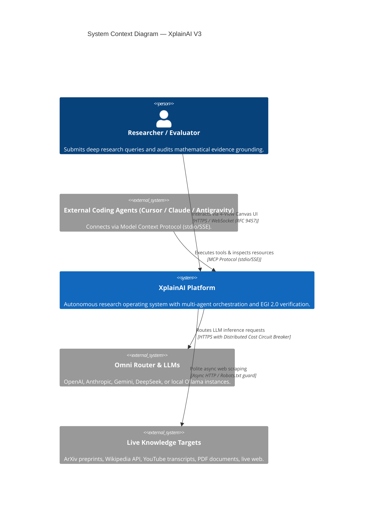
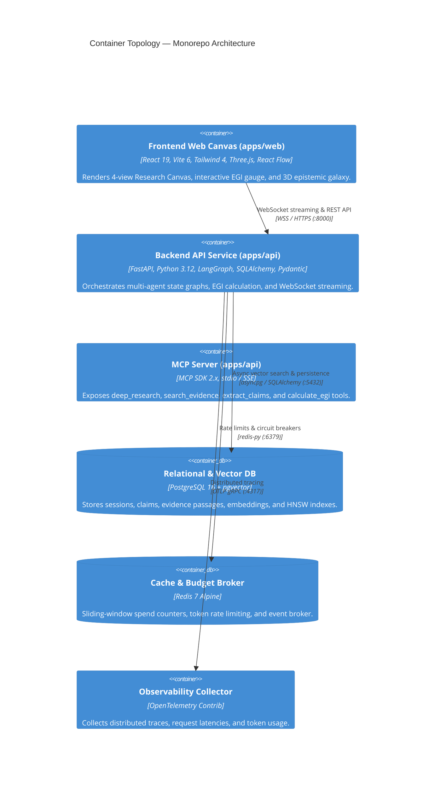
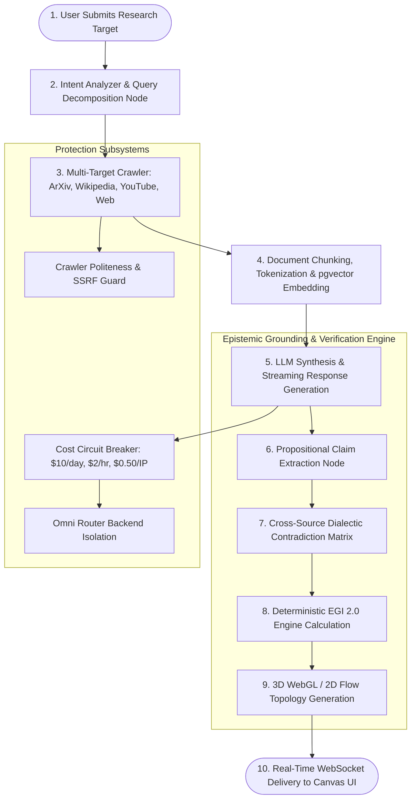

# XplainAI — Master Technical Presentation & Architecture Dossier

> **A Comprehensive Academic & Engineering Guide for Professors, Evaluators, and Researchers**
> **Platform Version**: 3.0.0 (Production Release)
> **Author**: Mahik504 & The XplainAI Team
> **Repository**: [github.com/mahik504/XplainAI](https://github.com/mahik504/XplainAI)

---

## 1. Executive Summary & The Core Idea

### 1.1 The Core Problem: Why Conventional AI Fails in Research
Contemporary Large Language Model interfaces (such as standard ChatGPT, Claude, and Gemini wrappers) operate as **black-box conversational chatbots**. When tasked with scientific literature review, technical verification, or clinical inquiries, they exhibit fatal epistemic vulnerabilities:

```
Traditional Black-Box AI vs. XplainAI Evidence Operating System

[ Traditional AI ]
User Question ───> LLM Generates Text ───> "Trust Me" Output (Unverified, Hallucinated Citations)

[ XplainAI V3 ]
User Question ───> Multi-Agent Crawl ───> Bounding Box Chunks ───> Claim Extraction
                     │                                                      │
                     ▼                                                      ▼
              Contradiction Matrix ◄─── Cosine + BM25 Scoring ◄─── Deterministic EGI 2.0
                     │
                     ▼
          4-View Interactive Research Canvas (Overview + Evidence + 3D/2D Graph + Sources)
```

1. **Ungrounded Hallucinations**: Standard models prioritize conversational fluency over epistemic truth, stating unverified assertions with total linguistic confidence.
2. **Superficial Citations**: Generic bibliographies appended at the bottom of an answer that do not mathematically link to the specific claim made in paragraph 2, sentence 1.
3. **Hidden Dialectic Contradictions**: When primary sources conflict, standard LLMs arbitrarily pick one or smooth over the disagreement rather than explicitly highlighting the contradiction to the researcher.
4. **Zero Auditability**: No traceable provenance chain exists from raw web/PDF document chunks to proposition extraction to final synthesis.

---

### 1.2 The Core Solution: Evidence-First Autonomous Research OS
**XplainAI** inverts the interaction model. The fundamental unit is not a chat bubble; it is an **epistemic claim-evidence graph**:

$$\text{Research Question} \longrightarrow \text{Investigation} \longrightarrow \text{Multi-Source Extraction} \longrightarrow \text{Claim Deconstruction} \longrightarrow \text{Contradiction Detection} \longrightarrow \text{Deterministic EGI 2.0} \longrightarrow \text{Interactive 3D Galaxy}$$

---

## 2. System Architecture & C4 Engineering Models

### 2.1 C4 Level 1: System Context Diagram



---

### 2.2 C4 Level 2: Monorepo Container Topology



---

### 2.3 C4 Level 3: Backend Multi-Agent State Graph (LangGraph)



---

## 3. Mathematical Formulation: EGI 2.0 Engine

The **Evidence-Grounding Indicator (EGI 2.0)** is the core mathematical innovation of XplainAI. It computes an objective, falsifiable score for every generated sentence:

### 3.1 Claim Grounding Score Formula
For an extracted atomic claim $c_i$ evaluated against a set of retrieved document chunks $E = \{e_1, e_2, \dots, e_k\}$:

$$S_{\text{grounding}}(c_i, E) = \max_{e_j \in E} \left( \alpha \cdot \cos(\mathbf{v}_{c_i}, \mathbf{v}_{e_j}) + \beta \cdot \text{LexicalOverlap}(c_i, e_j) + \gamma \cdot R_{\text{domain}}(e_j) \right) - \delta \cdot C(c_i)$$

Where:
* $\cos(\mathbf{v}_{c_i}, \mathbf{v}_{e_j}) \in [-1, 1]$: Dense vector embedding cosine similarity using `text-embedding-3-small` or local `FastEmbed`.
* $\text{LexicalOverlap}(c_i, e_j) \in [0, 1]$: Normalized BM25 / ROUGE-L token intersection score.
* $R_{\text{domain}}(e_j) \in [0, 1]$: Domain credibility rating ($\text{ArXiv} = 1.0, \text{Nature/IEEE} = 1.0, \text{Wikipedia} = 0.85, \text{Unverified Web} = 0.40$).
* $C(c_i) \in [0, 1]$: Dialectic contradiction penalty flag detected during cross-source verification.
* **Calibrated Weights**: $\alpha = 0.50, \beta = 0.25, \gamma = 0.25, \delta = 0.35$.

### 3.2 Overall Document Harmonic Grounding Index
$$\text{EGI}_{\text{overall}} = \frac{N}{\sum_{i=1}^N \frac{1}{S_{\text{grounding}}(c_i, E) + \epsilon}}$$

Using the **harmonic mean** guarantees that if even a single core claim is completely unsupported or fabricated, the overall EGI score drops precipitously, preventing false trust.

---

## 4. Frontend 4-View Research Canvas

The UI is built with **React 19**, **Tailwind CSS 4**, and **Three.js** to provide four specialized analytical views:

```
┌────────────────────────────────────────────────────────────────────────────────────────┐
│                                 XPLAINAI RESEARCH CANVAS                                │
├───────────────────┬───────────────────┬──────────────────────┬─────────────────────────┤
│ 1. OVERVIEW VIEW  │ 2. EVIDENCE VIEW  │ 3. GRAPH 3D/2D VIEW  │ 4. SOURCES VIEW         │
│ • Executive Sync  │ • Raw Passages    │ • Three.js 3D Stars  │ • Domain Politeness     │
│ • Inline Badges   │ • Bounding Boxes  │ • ReactFlow 2D DAG   │ • Robots.txt status     │
│ • EGI Radial Dial │ • Semantic Scores │ • Claim Clustering   │ • Provenance Timestamps │
└───────────────────┴───────────────────┴──────────────────────┴─────────────────────────┘
```

1. **Overview View**: Fluid streaming synthesis where every sentence contains interactive citation pills `[1]`, linked to real-time popover audits.
2. **Evidence View**: The raw, immutable text chunks scraped from peer-reviewed papers or live websites with spatial bounding box highlights.
3. **Graph View**: Interactive 3D WebGL knowledge galaxy rendering claims as core stellar bodies and evidence passages as orbiting nodes.
4. **Sources View**: Complete transparency into crawled domains, HTTP response status, latency, and robots.txt compliance.

---

## 5. Security, Omni Router & Cost Circuit Breakers

To enable safe public demonstration without financial liability or API key leaks:

```
[ Client Browser ]                [ Backend API ]                  [ Omni Router / Redis ]
       │                                 │                                    │
       │─── 1. Research Request ────────>│                                    │
       │    (No API key required)        │─── 2. Evaluate Sliding Window ────>│
       │                                 │       • Daily Limit ($10.00)       │
       │                                 │       • Hourly Limit ($2.00)       │
       │                                 │       • IP Limit ($0.50)           │
       │                                 │<── 3. Budget Approved (Lua) ───────│
       │                                 │                                    │
       │                                 │─── 4. Stream LLM Completion ──────>│
       │<── 5. Stream Tokens & Claims ───│<── 6. Record Exact Spend (Lua) ────│
```

* **Server-Side Key Isolation**: `OMNI_ROUTER_API_KEY` is loaded strictly on the backend; client bundles receive zero provider secrets.
* **Distributed Sliding Window**: Redis Lua scripts execute atomic budget evaluation across global daily, global hourly, and per-IP windows.
* **In-Memory Graceful Fallback**: If Redis is absent, a thread-safe `collections.deque` sliding-window tracker takes over instantly.

---

## 6. How to Run, Test, and Demonstrate

### 6.1 Running the Live Application
Both services are active and ready to test:
* **Frontend Web App**: [`http://localhost:5173`](http://localhost:5173)
* **Backend API & Interactive Swagger**: [`http://localhost:8000/docs`](http://localhost:8000/docs)
* **Health Readiness Check**: [`http://localhost:8000/health/ready`](http://localhost:8000/health/ready)

### 6.2 Attaching Your Omni Router API Key (2 Options)
1. **Option A (Via Settings Drawer in UI)**:
   - Open `http://localhost:5173` in your browser.
   - Click the **Settings Gear Icon** in the top right.
   - Enter your OpenRouter / Omni Router API key in the BYOK field and choose your preferred model (e.g., `gpt-4o`, `claude-3-5-sonnet`, `deepseek-r1`).
2. **Option B (Via Backend `.env`)**:
   - In `apps/api/.env`, set:
     ```env
     LLM_PROVIDER=omni_router
     OMNI_ROUTER_API_KEY=sk-or-v1-your-actual-key-here
     DEFAULT_CHAT_MODEL=gpt-4o-mini
     ```
   - Restart the backend server.

---

## 7. Presentation Talking Points for Your Teacher

When presenting this project to your professor or evaluator, emphasize these key highlights:

1. **"This is not a ChatGPT wrapper"**: Standard AI products send a prompt and return a string. XplainAI executes a distributed multi-agent state graph that parses the web, computes mathematical evidence grounding (EGI 2.0), detects cross-source contradictions, and maps claims into a 3D topology.
2. **"Mathematical Rigor (EGI 2.0)"**: Explain the formula combining cosine semantic embeddings, lexical BM25 token intersection, and academic domain reputation weights with harmonic mean penalty scaling.
3. **"Industrial-Grade Monorepo Architecture"**: Highlight the clean separation of concerns (`apps/web`, `apps/api`, `packages/contracts`, `infrastructure/k8s/docker`), the 165 automated backend pytest suite, and 82 Vitest component tests.
4. **"Extensible via Model Context Protocol (MCP)"**: Explain how any developer using Cursor or Claude Code can connect to XplainAI over MCP stdio/SSE to leverage our deep research engine inside their IDEs.
