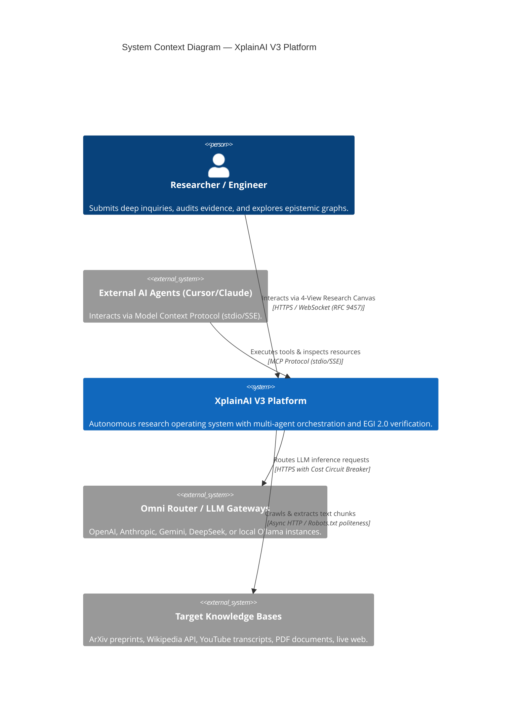
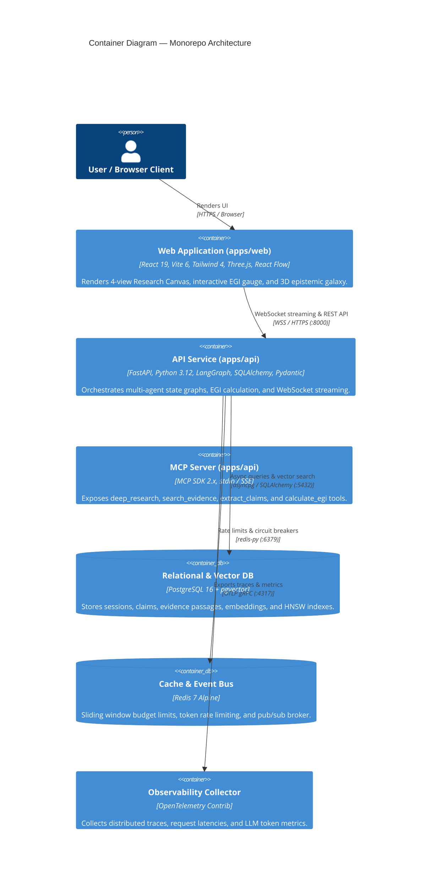
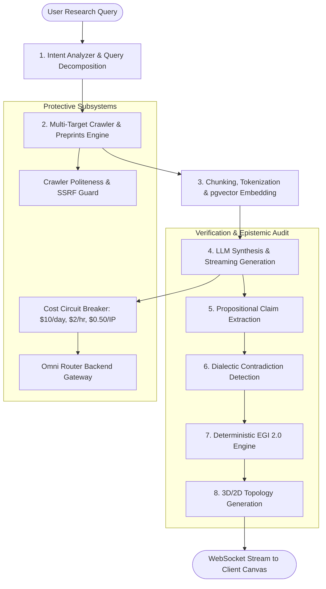

# XplainAI — Architecture Design & Epistemic System Specification

---

## 1. Executive Summary & Problem Formulation

### 1.1 The Problem: Black-Box Generative Hallucination
Contemporary conversational AI interfaces operate as generative language models producing fluid prose. However, in mission-critical, academic, scientific, and enterprise domains, they exhibit fundamental flaws:
1. **Ungrounded Hallucinations**: Plausible-sounding claims generated without verifiable grounding in source documents.
2. **Disconnected Citations**: Superficial URLs appended at the end of a response that do not mathematically support the specific assertion made in paragraph 3, sentence 2.
3. **Hidden Dialectic Contradictions**: When two peer-reviewed sources conflict, standard LLMs arbitrarily pick one or smooth over the disagreement rather than explicitly highlighting the contradiction.
4. **Lack of Epistemic Audit Trails**: Researchers cannot inspect the provenance chain from raw document chunk -> extracted proposition -> synthesized answer.

### 1.2 The Solution: Evidence-First Autonomous Research Operating System
**XplainAI** inverts the paradigm:
Question -> Deep Web Investigation -> Multi-Source Extraction -> Claim-Evidence Graph -> Contradiction Analysis -> Deterministic EGI 2.0 Grounding -> Interactive 3D Topology

---

## 2. Core Value Propositions (USP & MVP)

### 2.1 Unique Selling Proposition (USP)
* **Deterministic EGI 2.0 Engine**: Computes mathematical confidence and evidence grounding scores based on cosine semantic similarity, lexical overlap, domain reputation weights, and contradiction penalties.
* **4-View Research Canvas**: Instant switching between **Overview** (Synthesis & Citations), **Evidence** (Raw Chunks with Bounding Boxes), **Graph** (3D WebGL Constellation & 2D ReactFlow DAG), and **Sources** (Domain Politeness & Provenance).
* **Multi-Agent LangGraph State Machine**: Decoupled, stateful async nodes executing web crawling, proposition extraction, dialectic contradiction detection, and citation mapping.
* **Omni Router with Cost Circuit Breaker**: Distributed sliding-window budget limits ($10/day global, $2/hr global, $0.50/day per IP) enforcing zero-liability public demo access for testers without requiring user API keys.
* **Native Model Context Protocol (MCP)**: Full stdio and SSE MCP server endpoints exposing `deep_research`, `search_evidence`, `extract_claims`, and `calculate_egi` tools to external agents (Cursor, Claude Code, Antigravity).

### 2.2 MVP Capabilities
1. **Live Autonomous Web & Preprint Crawling**: SSRF-protected, robots.txt-polite multi-target crawler supporting ArXiv, Wikipedia, YouTube transcripts, and live HTML.
2. **Interactive Citation Inspector**: Clicking any citation badge `[1]` instantly highlights the supporting evidence text, shows exact document chunk metadata, and calculates proposition similarity.
3. **3D WebGL Constellation Visualizer**: Hardware-accelerated Three.js star cluster mapping claims as bright cores and supporting evidence as orbiting stellar nodes.
4. **Multi-Tenant Redis Rate Limiting**: RFC 9457 compliant sliding-window token bucket preventing denial-of-wallet attacks.

---

## 3. Real Frontend UI & Workspace Workflow

### 3.1 Hero & Deep Prompt Studio
The entry portal allows researchers to specify deep research targets, configure temperature/models, and trigger multi-source investigations with real-time ambient shader feedback.

### 3.2 Live Research Cockpit (4-View Canvas)
The live workspace displays streaming synthesis, interactive claim popovers, the deterministic EGI radial gauge, and multi-tab evidence auditing.

### 3.3 3D Evidence Constellation & 2D Flow Visualizer
Interactive 3D WebGL knowledge galaxy rendering epistemic clustering and claim-evidence topology in real time.

### 3.4 Model Selection & Omni Router Configuration
The settings drawer provides granular control over inference providers, BYOK mode, sliding-window cost counters, and export formats (Markdown, PDF, Evidence Packs).

---

## 4. System Topology & C4 Architecture Models

### 4.1 C4 Level 1: System Context Diagram

### 4.2 C4 Level 2: Container Diagram (Monorepo Layout)

### 4.3 C4 Level 3: LangGraph Agentic Pipeline State Machine

---

## 5. Mathematical Formulation of EGI 2.0

The **Evidence-Grounding Indicator (EGI 2.0)** evaluates the epistemic validity of each synthesized claim c_i against retrieved evidence chunks E = {e_1, e_2, ..., e_k}:

GroundingScore(c_i, E) = max_{e_j in E} [ alpha * cos(v_c_i, v_e_j) + beta * LexicalOverlap(c_i, e_j) + gamma * R_domain(e_j) ] - delta * C(c_i)

Where:
* cos(v_c_i, v_e_j): Dense vector embedding cosine similarity using text-embedding-3-small or FastEmbed.
* LexicalOverlap(c_i, e_j): Normalized BM25 / ROUGE-L token intersection score.
* R_domain(e_j) in [0, 1]: Pre-calibrated academic/scientific domain reputation weight (e.g., ArXiv = 1.0, Nature = 1.0, Wikipedia = 0.85, Unverified Blog = 0.40).
* C(c_i) in [0, 1]: Contradiction penalty flag detected during cross-source dialectic analysis.
* Weights: alpha = 0.50, beta = 0.25, gamma = 0.25, delta = 0.35.

---

## 6. Distributed Cost Circuit Breaker Specification

To guarantee zero-risk public testing without credit card exposure:

1. **Redis Lua Atomic Check & Spend**:
   * Evaluates spend within sliding windows (daily: 86400s, hourly: 3600s).
   * Atomically records turn spend across keys: `global_daily`, `global_hourly`, and `ip_daily:{client_ip}`.
2. **In-Memory Fallback**:
   * If Redis is offline, an asynchronous in-memory `collections.deque` sliding window tracker takes over automatically.

---

## 7. API Specification & Integration Endpoints

| Protocol | Endpoint | Description | Auth / Limit |
|---|---|---|---|
| **WebSocket** | `/ws/v1/chat` | Real-time LangGraph streaming, claim emission, and EGI updates | Anonymous Demo / BYOK |
| **REST** | `POST /api/v1/research/jobs` | Asynchronous research batch job creation | Bearer / Rate-limited |
| **REST** | `GET /api/v1/research/jobs/{id}` | Job status, claims, citations, and EGI payload | Bearer / Rate-limited |
| **REST** | `POST /api/v1/export/pdf` | Export synthesized research as a branded evidence pack PDF | Rate-limited |
| **REST** | `GET /health/live` | Kubernetes liveness probe | Public |
| **REST** | `GET /health/ready` | Kubernetes readiness probe (checks DB, Redis, LLM) | Public |
| **MCP** | `stdio / SSE (:8000/mcp)` | Model Context Protocol server exposing research tools | MCP Spec 2.x |
