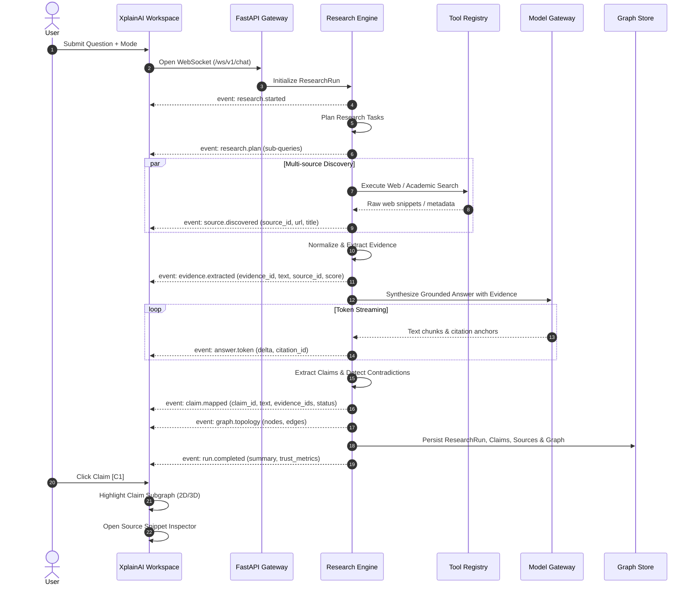

# XplainAI ? Data Flow & Event Protocol

## 1. End-to-End Execution Sequence

## 2. Semantic Event Schema
- `research.started`: `{ run_id, mode, query, timestamp }`
- `research.plan`: `{ run_id, tasks: [{ task_id, query, intent }] }`
- `source.discovered`: `{ run_id, source_id, title, url, domain, authority_score }`
- `evidence.extracted`: `{ run_id, evidence_id, source_id, snippet, confidence }`
- `answer.token`: `{ run_id, delta, citation_id? }`
- `claim.mapped`: `{ run_id, claim_id, text, status: "supported"|"unverified"|"contradicted", evidence_ids: [] }`
- `graph.topology`: `{ run_id, nodes: [], edges: [] }`
- `run.completed`: `{ run_id, status: "completed", metrics: { claims_count, verified_ratio, source_count } }`\n